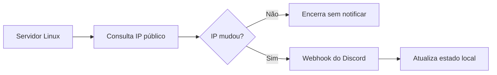

# Linux Server IP Notification

Pequena automação em Bash que detecta mudanças no IP público de um servidor Linux e envia uma notificação para um canal do Discord.

## Fluxo



## Características

- Consulta o IP público usando HTTPS.
- Mantém o último IP conhecido em um arquivo de estado local.
- Só envia mensagem quando detecta uma mudança.
- Usa timeout e falha explicitamente em erros HTTP.
- Recebe o webhook por variável de ambiente, sem gravar credenciais no repositório.
- Pode ser executado manualmente, pelo cron ou por um timer do systemd.

## Requisitos

- Linux
- Bash 4 ou superior
- curl
- Webhook de um canal do Discord

## Instalação

```bash
git clone https://github.com/Adrianozk/linux-server-ip-notification.git
cd linux-server-ip-notification
sudo ./install.sh
```

O instalador copia o script para:

```text
/usr/local/bin/notify-ip-to-discord
```

## Configuração

Defina a URL do webhook do Discord sem adicioná-la ao código:

```bash
export DISCORD_WEBHOOK_URL='https://discord.com/api/webhooks/SEU_WEBHOOK'
```

> Trate o webhook como uma credencial. Não o publique no GitHub, em logs ou capturas de tela.

## Teste manual

```bash
notify-ip-to-discord
```

Na primeira execução, o script envia o IP atual e cria o arquivo de estado. Nas execuções seguintes, só envia outra mensagem quando o IP mudar.

Por padrão, o estado fica em:

```text
~/.local/state/linux-server-ip-notification/last_ip.txt
```

## Execução periódica com cron

Abra o crontab do usuário:

```bash
crontab -e
```

Defina o webhook e execute o script a cada cinco minutos:

```cron
DISCORD_WEBHOOK_URL=https://discord.com/api/webhooks/SEU_WEBHOOK
*/5 * * * * /usr/local/bin/notify-ip-to-discord >/dev/null 2>&1
```

## Variáveis disponíveis

| Variável | Obrigatória | Descrição |
| --- | --- | --- |
| `DISCORD_WEBHOOK_URL` | Sim | URL do webhook usado para enviar a notificação |
| `IP_ENDPOINT` | Não | Endpoint alternativo para consultar o IP público |
| `XDG_STATE_HOME` | Não | Diretório-base alternativo para o arquivo de estado |

## Autor

Desenvolvido por [Adriano Luís Fernandes](https://github.com/Adrianozk) como uma automação para servidores Linux e ambientes de homelab.
